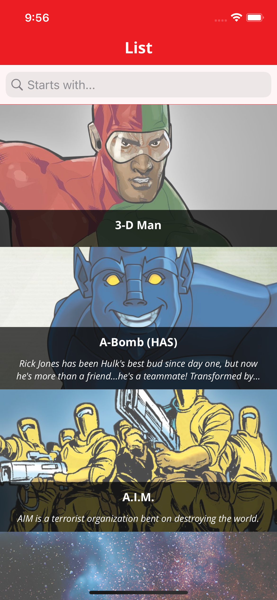
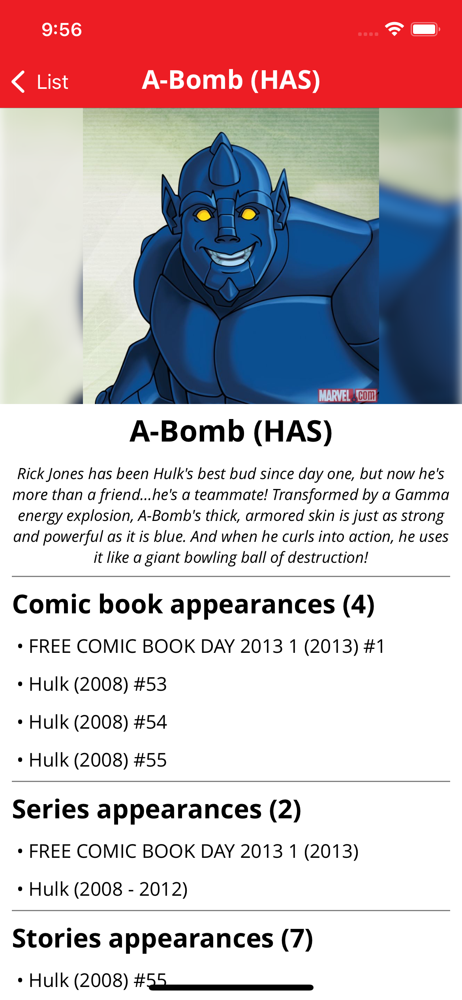

# Requisitos
+ App desarrollada con Xcode 13.0 en macOS Big Sur
+ Versión mínima iOS 15
+ Necesario realizar `pod install` antes de su primera ejecución.
+ El proyecto se ejecuta abriendo el fichero `AwesomeCharacters.xcworkspace`

# Descripción

Aplicación que consume la API oficial de MARVEL (https://developer.marvel.com/docs​)

La aplicación muestra un listado de personajes con paginación infinita. Permite filtrarlo por texto, donde buscará los personajes que empiecen por el texto escrito

# Screenshots

# Característcas

+ Localización de textos en inglés y español
+ Manejo de errores
+ Filtro por texto
+ Paginación infinita
+ Zoom sobre la imagen de detalle
+ Soporte para portrait and landscape
+ Uso del nuevo modelo de concurrencia `async-await` compatible a partir de iOS 13
+ Separación por capas. Esta desarrollada con una arquitectura modular. Es un VIPER eliminando la parte de wireframes.
+ Uso de genéricos
+ Programación orientada a protocolos
+ Uso de scripts de generación de código automáticos para textos, assets y fuentes
